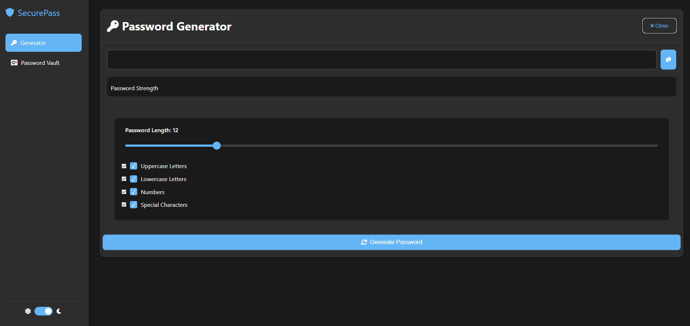

# SecurePass
<div align="center">
  
  
  
  

  <br />
  <br />

  <h2 align="center">SecurePass</h2>

  SecurePass is a fully responsive password manager application, <br />Responsive for all devices, build using HTML, CSS, and JavaScript.

  <a href="https://securepass-beta.vercel.app" target="_blank"><strong>➥ Live Demo</strong></a>

</div>

<br />

### Demo Screeshots



### Password Generator
- Customizable password length (8-32 characters)
- Character type selection:
  - Uppercase letters
  - Lowercase letters
  - Numbers
  - Special characters
- Real-time password strength meter
- One-click copy to clipboard

### Password Vault
- Local storage for secure password management
- Search functionality by website/username
- Add, view, and delete password entries
- Grid-based layout for easy viewing
- Copy passwords directly from vault

### User Interface
- Modern, responsive design
- Dark/Light theme support
- Smooth animations and transitions
- Intuitive tab-based navigation
- Mobile-friendly layout

## Security Features
- Client-side password generation
- Local storage only (no server communication)
- Masked password display
- Secure clipboard operations

## Getting Started

1. Clone the repository:
```bash
git clone https://github.com/r3dc0dez/SecurePass.git
```

2. Open `index.html` in your web browser
   - No server required
   - Works with any modern browser

## Browser Compatibility
- Chrome (recommended)
- Firefox
- Safari
- Edge

## Technical Details
- Pure HTML5, CSS3, and JavaScript
- No external dependencies
- Local storage for data persistence
- Font Awesome for icons
- Responsive grid layout

## Future Enhancements
- [ ] Export/Import vault functionality
- [ ] Password strength requirements
- [ ] Encrypted local storage
- [ ] Master password protection
- [ ] Password health check
- [ ] Browser extension support

## Contributing
Feel free to submit issues and enhancement requests!

## License
This project is licensed under the MIT License - see the LICENSE file for details.

## Security Notice
This application stores passwords in browser's local storage. While convenient, please be aware that this storage is not encrypted. For maximum security, consider using this tool in combination with other security measures.
[MIT](https://choosealicense.com/licenses/mit/)
